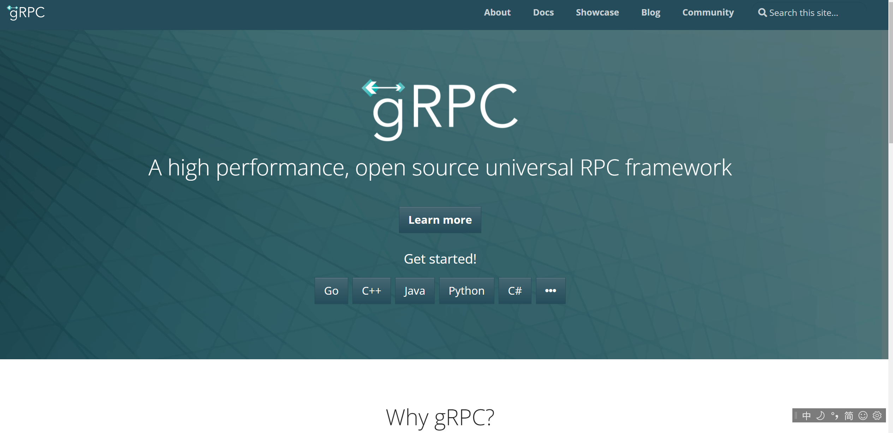

# 最简单的 gRPC 教程



gRPC 是 Google 开源的一个高性能的 RPC(Remote Procedure Call) 框架，它具有如下的优点：

- **提供高效的进程间通信**。`gRPC` 没有使用 `XML` 或者 `JSON` 这种文本格式，而是采用了基于 `protocol buffers` 的二进制协议；同时，`gRPC` 采用了 `HTTP/2` 做为通信协议，从而能够快速的处理进程间通信。
- **简单且良好的服务接口和模式**。`gRPC` 为程序开发提供了一种契约优先的方式，必须首先定义服务接口，才能处理实现细节。
- 支持多语言。`gRPC` 是语言中立的，我们可以选择任意一种编程语言，都能够与 `gRPC` 客户端或者服务端进行交互。
- **成熟并且已被广泛使用**。通过在 Google 的大量实战测试，`gRPC` 已经发展成熟。


参考书籍：[《gRPC与云原生应用开发》](https://item.jd.com/10026591237101.html)

# 1 初识 gRPC

我们构建一个商品服务，命名为 ProductInfo，客户端和服务端的交互模式如下：


首先我们需要定义 protobuf：

我们定义了一个 ProductInfo 服务，其中有两个方法，分别是**添加商品**和**获取商品**，然后在 proto 文件所在的目录下执行命令 `protoc --go_out=plugins=grpc:../product ProductInfo.proto`。

如果没有安装 protoc，执行命令 `go get -u github.com/golang/protobuf/protoc-gen-go` 进行安装。虽然 gRPC 支持多种语言，但是为了统一，我文章中的代码都使用 Go。

> 重新编译更新的 `.proto` 文件：

```shell
# 参考编译 example
protoc --go_out=. --go_opt=paths=source_relative \
    --go-grpc_out=. --go-grpc_opt=paths=source_relative \
    helloworld/helloworld.proto

# grpc-demo 生成的 pb.go 文件和.proto 在相同路径
protoc --go-grpc_out=. --go-grpc_opt=paths=source_relative ProductInfo.proto 

# 会把pb.go放在嵌套子目录下 github.com/yuancf1024/grpc-demo
protoc --go-grpc_out=../product ProductInfo.proto

protoc --go_out=. --go_opt=paths=source_relative \
    --go-grpc_out=. --go-grpc_opt=paths=source_relative \
    ProductInfo.proto

protoc --go_out=. --go_opt=paths=source_relative \
    ProductInfo.proto
```

执行完之后，在 proto 文件同级目录下会出现一个 `ProductInfo.pb.go` 文件：


然后在 product 文件夹下新建一个 server 文件夹，然后新建一个 main.go 文件，首先在文件中实现 ProductInfo 服务的两个方法的业务逻辑：

然后继续在 main.go 文件中添加一个 main 方法，建立一个 gRPC 服务器：

服务端的逻辑就到这里了，接下来再写一下客户端的逻辑，建立一个 client 文件夹，然后新建一个 main.go 文件，内容如下：